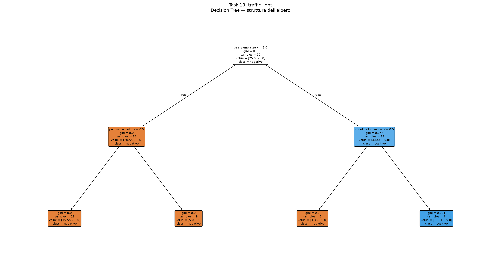
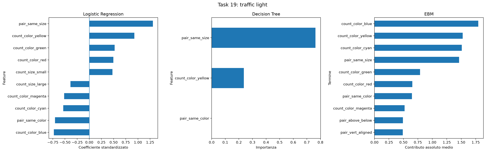
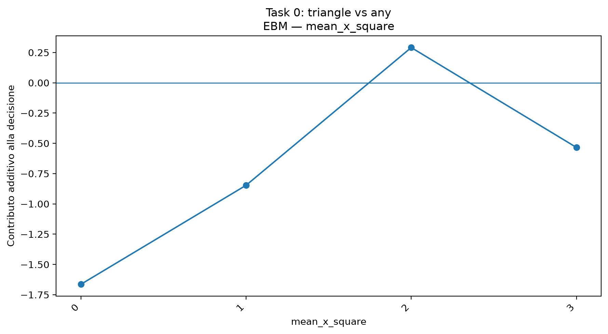
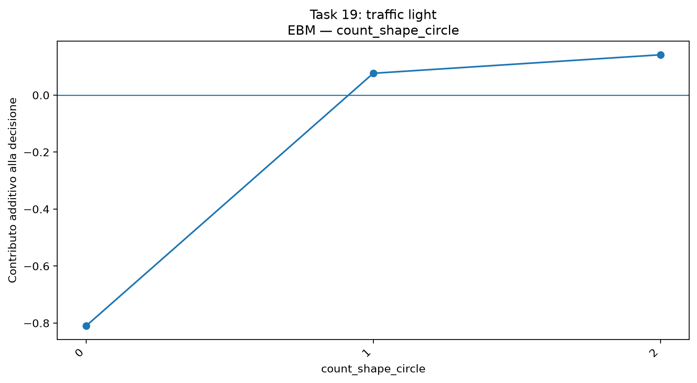
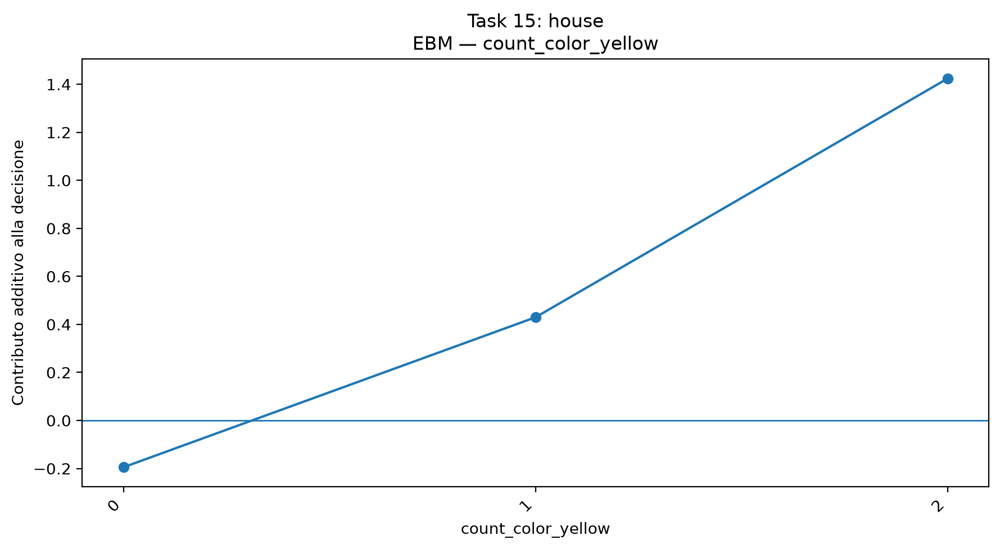
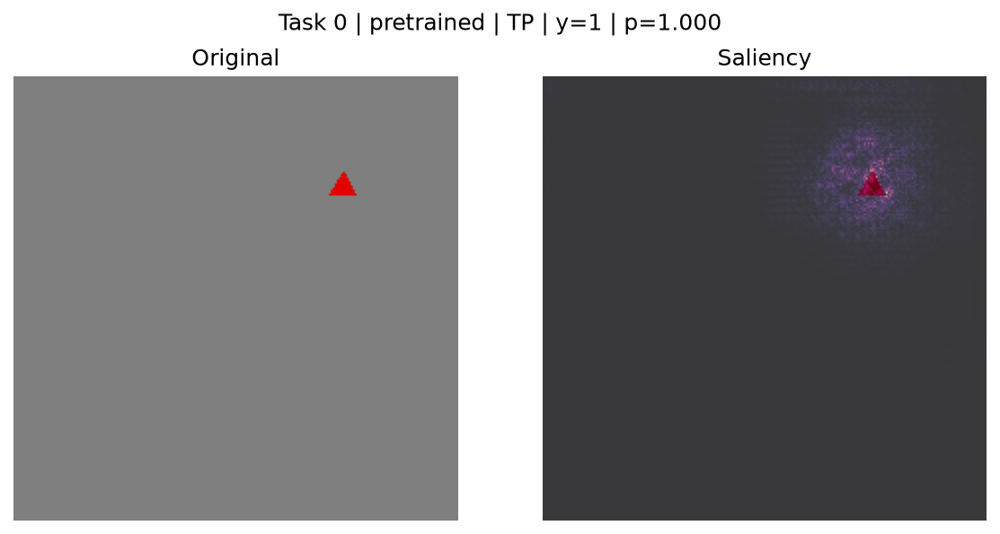
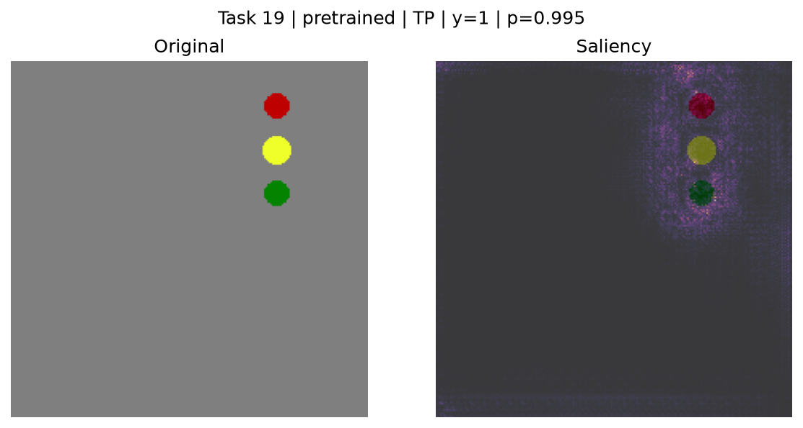
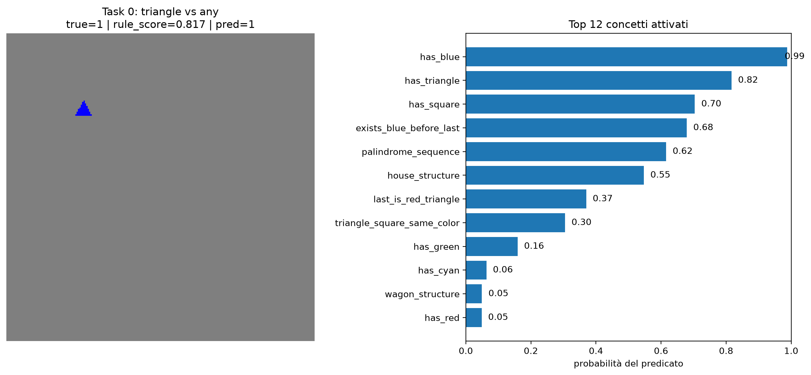
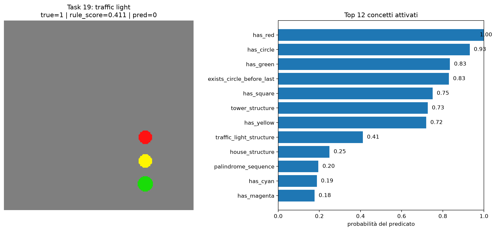

# KANDY Easy — analisi di modelli interpretabili, CNN e ragionamento sui concetti

## 1. Obiettivo del progetto

Questo progetto studia come affrontare i compiti di classificazione di **KANDY Easy** usando approcci con livelli diversi di interpretabilità.

L'idea di fondo è confrontare:

- una pipeline basata su **feature visive costruite direttamente dalle immagini** e modelli classici interpretabili;
- una **CNN ResNet-18** usata come modello di riferimento;
- un'analisi delle decisioni della CNN tramite **mappe di salienza, SHAP**;
- un modello **neuro-simbolico basato su predicati semantici**, in cui l'immagine viene trasformata in un insieme di concetti e questi concetti vengono poi combinati attraverso regole simboliche.

Il progetto non vuole soltanto massimizzare l'accuratezza. L'obiettivo è capire **quali informazioni vengono utilizzate dal modello**, quanto queste informazioni sono interpretabili e dove l'interpretabilità diventa più difficile quando il compito richiede strutture composte.

---

## 2. Dataset KANDY Easy

KANDY Easy contiene 20 task di classificazione binaria. I task vanno da proprietà semplici, come la presenza di un triangolo o di un determinato colore, a proprietà più strutturate, come:

- un triangolo rosso nell'ultima posizione;
- un triangolo e un quadrato dello stesso colore;
- una sequenza palindroma;
- strutture come casa, macchina, torre, carro e semaforo.

Nel dataset sono presenti anche perturbazioni del colore e della dimensione, quindi il modello non può affidarsi semplicemente alla perfetta corrispondenza con un'immagine prototipo.

Un aspetto importante della configurazione è che la descrizione simbolica (`symbol`) viene usata per ricavare informazioni semantiche solo nelle analisi in cui queste annotazioni servono come riferimento. **Non viene usata come ingresso diretto dei classificatori visivi.**

Per i modelli interpretabili, le immagini vengono prima analizzate con una pipeline percettiva costruita a mano. Questa parte comprende segmentazione per colore, componenti connesse e stima di proprietà geometriche.

---

## 3. Estrazione di feature visive interpretabili

La prima parte sperimentale prova a capire quanto sia possibile risolvere i task senza ricorrere direttamente a una rete neurale.

Dalle immagini vengono estratte feature relative a:

- numero di oggetti;
- conteggio delle diverse forme;
- conteggio dei diversi colori;
- dimensione;
- posizione media;
- relazioni generiche tra coppie di oggetti;
- allineamento orizzontale e verticale;
- vicinanza;
- uguaglianza di forma, colore e dimensione.

La parte di visione artificiale è volutamente semplice e trasparente: l'obiettivo non è costruire un detector generico, ma ottenere una rappresentazione che permetta di studiare direttamente il comportamento dei modelli interpretabili.

> **Nota sullo sviluppo:** nella progettazione e nel controllo della parte di classificazione geometrica delle forme è stato utilizzato anche ChatGPT come supporto. Le feature finali e la pipeline usata negli esperimenti restano comunque esplicite e ispezionabili nel codice.

### Qualità della percezione

Sul test set la pipeline percettiva ottiene:

| Metrica | Valore |
|---|---:|
| MAE sul numero di oggetti | 0.244 |
| Conteggio esatto | 0.788 |
| Accuratezza forma | 0.945 |
| Accuratezza colore | 1.000 |
| Accuratezza dimensione | 0.911 |

Questo risultato è importante perché mostra che gli errori della parte percettiva esistono, ma non sono tali da rendere inutilizzabile la rappresentazione. In particolare, **il colore viene riconosciuto molto bene**, mentre il conteggio degli oggetti e la dimensione sono leggermente più difficili.

---

## 4. Modelli interpretabili

Sulla rappresentazione ottenuta dalla percezione vengono confrontati tre modelli:

- **Logistic Regression**, utile per vedere direttamente segno e peso delle feature;
- **Decision Tree**, utile perché esprime la decisione come una sequenza esplicita di condizioni;
- **Explainable Boosting Machine (EBM)**, che rappresenta il contributo delle singole feature tramite funzioni additive.

La valutazione viene fatta task per task, mantenendo separata la fase di selezione sulla validation e quella di valutazione finale.

### Confronto tra feature percettive e relazioni generiche

La media dell'F1 sui 20 task passa da circa **0.783** usando le sole feature percettive a circa **0.806** includendo anche le relazioni generiche.

Il miglioramento è quindi presente ma non enorme. Questo suggerisce che le relazioni aggiuntive aiutano, ma **non risolvono da sole i compiti più strutturati**.

### Decision Tree

Per il Decision Tree vengono salvate sia la feature importance sia la rappresentazione completa dell'albero.

Per esempio, nel task del semaforo l'albero trovato è molto compatto e utilizza condizioni come `pair_same_size`, `pair_same_color` e `count_color_yellow`.

Questa figura è interessante anche per un altro motivo: la regola originale del task semaforo richiede una struttura ordinata di tre cerchi, mentre l'albero usa alcune proprietà generiche che separano bene i campioni disponibili. Quindi la trasparenza del modello non significa automaticamente che la regola appresa coincida con la struttura semantica originale del problema.

[](results/interpretable_models/plots/task_19_decision_tree.png)

[Apri direttamente l'immagine in alta risoluzione](results/interpretable_models/plots/task_19_decision_tree.png)

**Dove mettere l'immagine:** mantenere il file nella cartella `results/interpretable_models/plots/`, come mostrato sopra. Lo stesso schema viene usato per gli altri task.

### Confronto tra i tre modelli

Per avere una visione sintetica vengono salvate anche figure che mettono a confronto Logistic Regression, Decision Tree ed EBM.

[](results/interpretable_models/plots/task_19_interpretable_models_summary.png)

[Apri direttamente l'immagine in alta risoluzione](results/interpretable_models/plots/task_19_interpretable_models_summary.png)

La differenza visiva tra i tre approcci è significativa:

- la Logistic Regression mostra quali feature spingono la decisione verso una classe o verso l'altra;
- il Decision Tree mostra una procedura di decisione leggibile passo per passo;
- l'EBM mostra invece quanto ogni termine contribuisce alla decisione.

---

## 5. Explainable Boosting Machine

L'EBM risulta particolarmente utile perché permette di andare oltre la semplice classifica delle feature.

Nel test finale l'EBM raggiunge una media di:

| Metrica | Media |
|---|---:|
| Accuracy | 0.862 |
| F1 | 0.835 |

Le figure salvate mostrano anche le **curve dei contributi** delle singole feature.

Queste curve permettono di vedere non solo che una variabile è importante, ma **come cambia il suo contributo** quando assume valori diversi.

### Esempio: posizione media del quadrato

[](results/interpretable_models/plots/task_0_ebm_mean_x_square.png)

[Apri il grafico EBM](results/interpretable_models/plots/task_0_ebm_mean_x_square.png)

In questo grafico il contributo non è costante: alcune posizioni spingono la decisione verso la classe positiva, mentre altre la spingono verso la negativa. Questo è un tipo di informazione che non sarebbe visibile guardando soltanto una feature importance.

### Esempio: conteggio dei cerchi nel task semaforo

[](results/interpretable_models/plots/task_19_ebm_count_shape_circle.png)

[Apri il grafico EBM](results/interpretable_models/plots/task_19_ebm_count_shape_circle.png)

Qui si nota una relazione molto più intuitiva: avere zero cerchi porta un contributo negativo, mentre la presenza di uno o più cerchi sposta il contributo nella direzione positiva. La curva non descrive da sola tutta la regola del task, ma mostra bene **una componente della decisione**.

### Esempio: presenza di giallo nel task "house"

[](results/interpretable_models/plots/task_15_ebm_count_color_yellow.png)

[Apri il grafico EBM](results/interpretable_models/plots/task_15_ebm_count_color_yellow.png)

La curva cresce al crescere del numero di elementi gialli. Anche in questo caso l'EBM rende visibile la relazione appresa invece di ridurla a un singolo numero.

Le figure delle curve vengono salvate nella stessa cartella:

`results/interpretable_models/plots/`

Sono presenti più grafici per ciascun task; nel README conviene inserire solo alcuni esempi rappresentativi come quelli sopra, lasciando il resto nella cartella dei risultati.

---

## 6. CNN ResNet-18

Come riferimento viene utilizzata una ResNet-18 in due configurazioni:

- con pesi inizializzati tramite ImageNet;
- addestrata da zero.

Sono stati eseguiti 40 esperimenti complessivi, cioè 20 task per ciascuna configurazione.

I risultati medi sul test set sono:

| Modello | Accuracy media | F1 media |
|---|---:|---:|
| ResNet-18 pretrained | **0.862** | **0.855** |
| ResNet-18 scratch | 0.650 | 0.604 |

La differenza è netta. Il modello con pretraining risulta molto più stabile ed efficace, mentre l'addestramento da zero soffre soprattutto nei task più piccoli o strutturati.

Questo confronto serve anche per la parte successiva: avere un modello più accurato non significa automaticamente avere un modello più interpretabile.

---

## 7. Analisi delle rappresentazioni e delle decisioni

Per capire cosa succede dentro la CNN sono state analizzate sia le decisioni finali sia alcune rappresentazioni interne.

Sono state considerate cinque famiglie di task:

- task 0: triangolo;
- task 9: triangolo rosso nella parte destra;
- task 13: triangolo e quadrato dello stesso colore;
- task 14: palindromo;
- task 19: semaforo.

### Mappe di salienza

Le mappe di salienza permettono di vedere quali zone dell'immagine influenzano maggiormente la decisione della rete.

Un caso semplice è il task del triangolo:

[](results/shap/saliency/task_00_pretrained_TP_0003.png)

[Apri la mappa di salienza](results/shap/saliency/task_00_pretrained_TP_0003.png)

Qui l'attenzione è concentrata soprattutto sulla regione che contiene l'oggetto. Questo comportamento è coerente con il fatto che il task può essere deciso osservando direttamente la presenza della forma.

Nel task semaforo si osserva invece una regione di attivazione distribuita lungo la struttura verticale:

[](results/shap/saliency/task_19_pretrained_TP_0022.png)

[Apri la mappa di salienza](results/shap/saliency/task_19_pretrained_TP_0022.png)

Questo è un esempio interessante perché la rete non evidenzia soltanto un singolo oggetto isolato, ma una zona che comprende la sequenza dei tre elementi.

Le mappe dei casi falsi sono ancora più utili per capire i limiti del modello. Per esempio, in un falso positivo la rete può concentrarsi su una configurazione visivamente simile alla struttura desiderata senza che la regola completa sia soddisfatta.

### SHAP

Per i casi selezionati vengono inoltre salvate le spiegazioni SHAP.

Sono stati scelti esempi di:

- vero positivo;
- vero negativo;
- falso positivo;
- falso negativo,

quando disponibili per il task e la configurazione considerata.

Questo permette di confrontare non soltanto "dove guarda la rete", ma anche **come le parti dell'immagine contribuiscono alla predizione**.

---

## 8. Modello neuro-simbolico basato sui concetti

In questa fase viene utilizzato un Concept Bottleneck Model (CBM), cioè un modello che inserisce esplicitamente i concetti tra l'immagine e la decisione finale.

La pipeline è quindi:

immagine;
estrazione delle rappresentazioni visive tramite una ResNet-18 preaddestrata;
predizione dei concetti semantici;
applicazione di regole simboliche sui concetti predetti;
classificazione binaria del task.

Il modello è supervisionato sui concetti: per ogni immagine vengono costruite offline le etichette dei concetti a partire dalla rappresentazione simbolica disponibile nel dataset. La rete impara quindi a riconoscere questi concetti dall'immagine, mentre la parte simbolica li combina per ottenere lo score del task.

Il vocabolario comprende concetti semplici, come:

presenza di triangolo, quadrato o cerchio;
presenza dei diversi colori;

e concetti più strutturati, come:

last_is_red_triangle;
exists_circle_before_last;
exists_blue_before_last;
triangle_square_same_color;
palindrome_sequence;
house_structure;
car_structure;
tower_structure;
wagon_structure;
traffic_light_structure.

L'obiettivo del CBM è quindi separare la percezione dal ragionamento:

percezione: l'immagine viene trasformata in una rappresentazione esplicita di concetti;
ragionamento: le regole simboliche combinano questi concetti per decidere se l'immagine soddisfa la regola del task.

In questo modo, invece di avere direttamente una funzione immagine -> classe, la decisione passa attraverso una rappresentazione intermedia interpretabile.

### Esempi di predizione dei concetti

Per rendere visibile questa rappresentazione intermedia, il notebook salva alcune immagini in cui vengono mostrati i **12 concetti con probabilità più alta** insieme alla predizione finale del task.

[](results/neuro_symbolic_final/concept_visualizations/test_index_0_task_0_concepts.png)

[Apri la visualizzazione dei concetti - esempio 1](results/neuro_symbolic_final/concept_visualizations/test_index_0_task_0_concepts.png)

[](results/neuro_symbolic_final/concept_visualizations/test_index_490_task_19_concepts.png)

[Apri la visualizzazione dei concetti - esempio 2](results/neuro_symbolic_final/concept_visualizations/test_index_490_task_19_concepts.png)

Queste immagini mostrano concretamente il passaggio dall'immagine alla rappresentazione concettuale, permettendo di vedere quali concetti il modello considera più attivi prima della decisione finale.


---

### Oracolo simbolico

Quando vengono utilizzati direttamente i predicati corretti ricavati dalla descrizione simbolica, le regole raggiungono:

- Accuracy media: **1.000**
- F1 medio: **1.000**

Questo risultato mostra che il vocabolario dei predicati e le regole sono sufficienti per esprimere le task considerate. La difficoltà del modello neurale sta quindi soprattutto nel **grounding dei concetti a partire dall'immagine**.

### Modello neurale

Nel modello addestrato sulle immagini la media finale è:

- Accuracy: **0.828**
- F1: **0.772**

Il divario rispetto all'oracolo è molto utile da interpretare: la componente simbolica è deterministica, mentre la parte difficile è riconoscere correttamente i concetti visivi.

---

## 9. Qualità dei concetti

L'analisi dei predicati mostra una differenza importante fra concetti semplici e concetti strutturali.

I concetti elementari tendono ad essere appresi molto meglio. Alcuni esempi di F1 sono:

| Concetto | F1 |
|---|---:|
| `has_red` | 0.964 |
| `has_circle` | 0.883 |
| `has_blue` | 0.882 |
| `has_magenta` | 0.857 |
| `has_green` | 0.850 |
| `palindrome_sequence` | 0.847 |
| `last_is_red_triangle` | 0.820 |

Le strutture più complesse sono molto più difficili. In particolare:

| Concetto | F1 |
|---|---:|
| `traffic_light_structure` | 0.400 |
| `wagon_structure` | 0.348 |
| `triangle_square_same_color` | 0.341 |
| `tower_structure` | 0.219 |
| `house_structure` | 0.186 |
| `car_structure` | 0.105 |

La cosa che si nota è che **riconoscere un attributo locale è molto più semplice che riconoscere una relazione strutturale tra più oggetti**.

Questo è uno dei risultati centrali del progetto: introdurre un collo di bottiglia concettuale rende la rappresentazione più leggibile, ma non elimina la difficoltà del problema. La difficoltà si sposta sulla qualità dei concetti che devono essere appresi.

---

## 10. Interventi sui concetti

Per analizzare quanto i singoli concetti influenzino la decisione finale, sono stati effettuati interventi artificiali sui valori predetti dal modello.

L'idea è semplice: per una stessa immagine si prende la rappresentazione concettuale prodotta dal modello e si modifica il valore di un solo concetto, lasciando invariati tutti gli altri. Si ricalcola quindi lo score prodotto dalla regola simbolica e si misura quanto cambia rispetto allo scenario originale.

Ad esempio, disattivando `last_is_red_triangle`, lo score medio della regola diminuisce di circa **0.122**. Tra i concetti che mostrano un effetto più evidente compaiono anche `exists_circle_before_last`, `exists_blue_before_last` e `has_square`.

Questo esperimento permette quindi di misurare l'influenza dei singoli concetti sulla decisione del modello, andando oltre la semplice osservazione delle correlazioni tra concetti e predizioni.

---

## 11. Robustezza ai concetti rumorosi

È stata infine valutata la sensibilità del modello a errori nella rappresentazione concettuale. Una percentuale crescente dei concetti predetti viene alterata artificialmente e si misura la variazione dell'accuratezza finale.

| Rumore sui concetti | Accuracy |
|---|---:|
| 0% | 0.828 |
| 5% | 0.814 |
| 10% | 0.782 |
| 20% | 0.730 |
| 30% | 0.660 |

La performance diminuisce progressivamente all'aumentare del rumore: il modello rimane relativamente stabile per piccole perturbazioni, mentre il degrado diventa più marcato quando una parte consistente dei concetti viene alterata.

Il risultato evidenzia quindi la dipendenza della decisione finale dalla qualità della rappresentazione concettuale.

---

## 13. Considerazioni finali

Nel complesso, gli esperimenti mostrano una differenza netta fra i diversi modi di ottenere interpretabilità.

I modelli classici sono facili da leggere direttamente, ma dipendono molto dalla qualità delle feature costruite a monte. Il Decision Tree è particolarmente intuitivo perché mostra una sequenza esplicita di condizioni, ma può imparare scorciatoie che separano bene i campioni senza rappresentare fedelmente la regola semantica sottostante.

La CNN pretrained ottiene invece una performance molto più alta rispetto alla CNN addestrata da zero e raggiunge una media di **0.862 di accuracy** e **0.855 di F1**. Le mappe di salienza e SHAP permettono di studiare le decisioni, ma mostrano soprattutto associazioni visive e non costituiscono da sole una descrizione simbolica della regola.

L'EBM rappresenta un buon compromesso fra performance e leggibilità: oltre alla classifica delle feature, permette di vedere la forma delle relazioni apprese tramite le curve dei contributi.

Il modello neuro-simbolico aggiunge un livello semantico esplicito. L'oracolo raggiunge il 100%, mentre il modello neurale arriva a **0.828 di accuracy e 0.772 di F1**. La differenza evidenzia chiaramente che il collo di bottiglia principale è l'apprendimento dei concetti dall'immagine. I concetti semplici vengono appresi bene, mentre quelli che richiedono composizione e relazioni fra più elementi rimangono molto più difficili.

---

## 14. Struttura dei risultati

La cartella `results/` contiene i risultati numerici e le figure prodotte durante gli esperimenti.

```text
results/
├── interpretable_models/
│   ├── *.csv
│   └── plots/
│       ├── alberi dei Decision Tree
│       ├── coefficienti Logistic Regression
│       ├── importanza delle feature
│       ├── confronti tra modelli
│       └── curve EBM
│
├── neuro_symbolic_final/
│   ├── oracle_results.csv
│   ├── concept_interventions.csv
│   └── concept_noise_robustness.csv
│
└── shap/
    ├── selected_cases.csv
    ├── saliency_statistics.csv
    ├── saliency/
    └── shap/
```

## 15. Tool AI utilizzati

Durante lo sviluppo del progetto sono stati utilizzati anche strumenti di supporto basati su intelligenza artificiale.

- **Claude Code Sonnet 5**
- **ChatGPT — GPT-5.6 Luna**

Questi strumenti sono stati utilizzati come supporto alla progettazione, al controllo del codice, al debug e alla discussione dei risultati. Le scelte metodologiche, gli esperimenti e l'interpretazione finale dei risultati sono stati verificati sui dati prodotti dal progetto.
